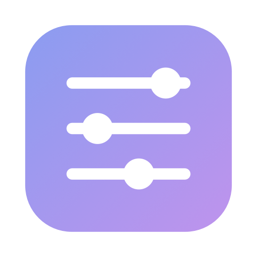
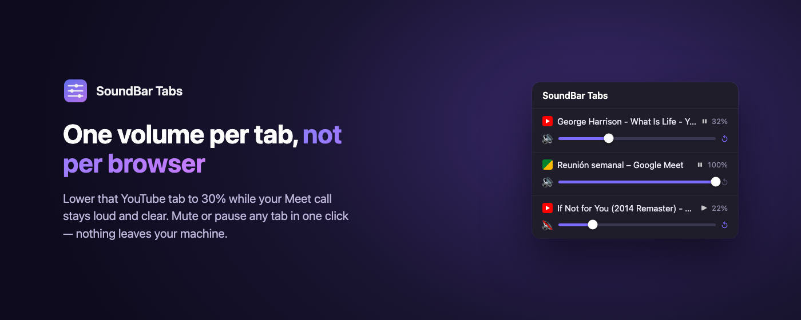
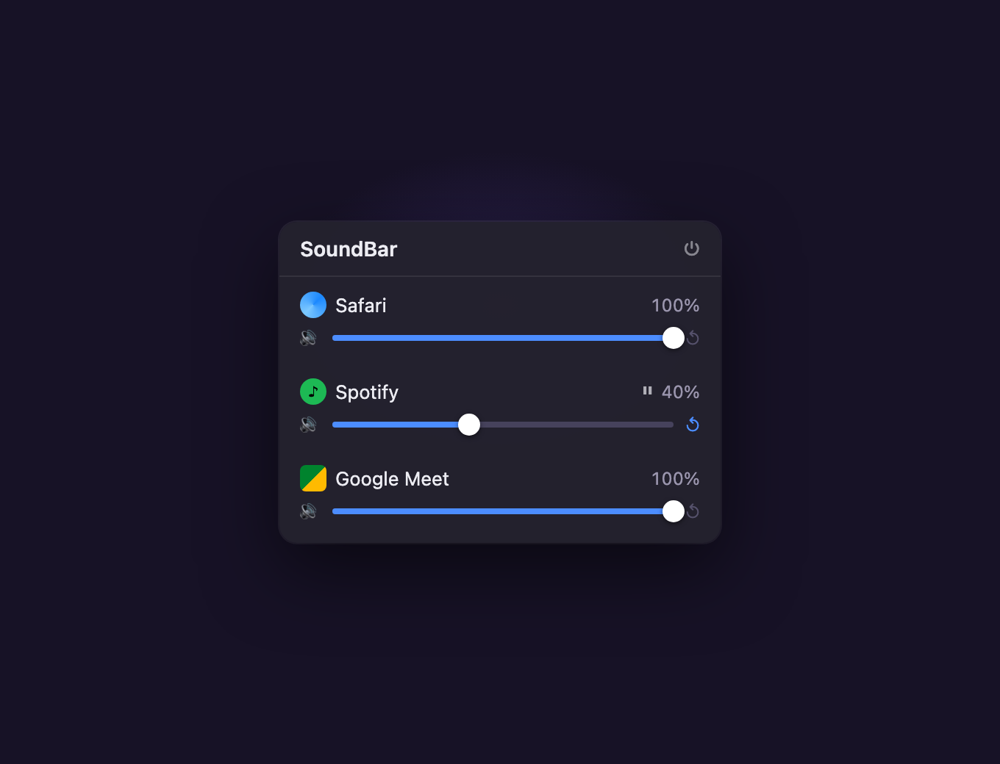
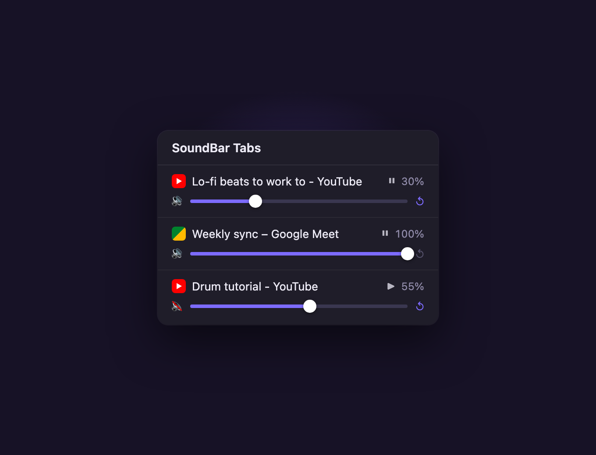

<p align="center">
  
</p>

<h1 align="center">SoundBar</h1>

<p align="center">
  <b>Your Mac has one volume for everything. SoundBar gives every app — and every browser tab — its own.</b>
</p>

<p align="center">
  <a href="https://github.com/malenitaa/soundbar/releases/latest"></a>
  <a href="./LICENSE"></a>
  
  <a href="./SECURITY.md"></a>
</p>

<p align="center">
  
</p>

## Why

On a call while music plays in the background? On Windows you'd open the volume
mixer. On a Mac, there isn't one: your only option is hunting through each app's
own settings. SoundBar fixes that with two small tools that share one idea —
every sound source gets its own slider.

## The Mac app

<p align="center">
  
</p>

A panel in your menu bar with a slider for every app that's playing sound.
Lower Spotify to 30% while your Meet call stays at 100%. Tap the speaker to
mute an app entirely; Spotify, Apple Music and Apple TV also get a play/pause
button.

**Make it yours.** The panel comes in two finishes — **glass**, the same
translucent material the rest of your Mac uses (on macOS 26 that means Liquid
Glass), or **solid**, an opaque panel that's easier to read over busy
wallpapers. One click in the panel's header switches; your choice is
remembered.

**It speaks your language.** English and Spanish, picked automatically from
your Mac's system language.

No drivers, no kernel extensions, no background service you can't see: it's
one icon in your menu bar, and quitting it is one click.

## The browser extension

<p align="center">
  
</p>

**SoundBar Tabs** brings the same idea inside Chrome, Brave and Edge, where
macOS can't see individual tabs. Click the icon to see every tab that's
playing audio — each with its own volume slider, mute and play/pause. Paused
tabs stay in the list so you can bring them back.

## Things that look like bugs (and aren't)

Read this before opening an issue — these are all by design:

- **Volume goes down, not up.** SoundBar attenuates; it won't boost past 100%
  or distort your audio.
- **At 100% SoundBar steps out of the way completely** — audio flows directly
  from the app to your speakers again, with zero added latency.
- **The first time you lower a slider, macOS asks permission to "record
  system audio".** That's Apple's wording for its official mechanism, and the
  only way to adjust another app's audio. Nothing is recorded or stored —
  see [SECURITY.md](SECURITY.md).
- **Paused apps stay in the list for a while** (up to 30 minutes, while the
  app is open). That's so pausing Spotify doesn't make its slider vanish.
- **The Mac app can't separate browser tabs.** macOS sees a browser as a
  single audio source. That's exactly what SoundBar Tabs is for.
- **The extension's sliders reset when you close the browser.** Per-tab
  volumes live only for the browser session — tabs don't survive a restart,
  so their settings don't either. Mute uses the browser's own tab muting and
  behaves like it always does.
- **Some web players ignore the extension's slider.** A few sites produce
  sound in a way the slider can't reach; the big ones (YouTube, Meet,
  Spotify's web player) all work. Mute always works.

## Install

Step-by-step instructions for both pieces — including what macOS will ask you
and why — are in [INSTALL.md](INSTALL.md).

The short version: grab `SoundBar-x.y.z.dmg` from the
[latest release](https://github.com/malenitaa/soundbar/releases/latest)
(Apple Silicon and Intel, macOS 14.4+), drag it to Applications. The
extension is under review on the Chrome Web Store; until it lands, INSTALL.md
shows how to load it from this repo in one minute.

## Privacy

- **No network access, ever** — no server, no accounts, no analytics, no
  update checks, in the app or the extension.
- **Nothing is recorded.** Audio is adjusted on the way to your speakers and
  never written anywhere.
- The extension keeps your per-tab volumes on your device only, and the
  browser erases them when you close it
  ([extension privacy policy](extension/PRIVACY.md)).
- The full threat model — what each piece touches and what it never will —
  is in [SECURITY.md](SECURITY.md).

## Development

```bash
git clone https://github.com/malenitaa/soundbar.git
cd soundbar
./scripts/build-app.sh
open dist/SoundBar.app
```

The extension needs no build step: load `extension/` unpacked.

Issues and PRs welcome.

## Enjoyed it?

If this was useful and you'd like to support the project:

- [Cafecito](https://cafecito.app/rezamalena)
- [Ko-fi](https://ko-fi.com/malenitaa)

## License

[MIT](LICENSE)

---

<p align="center"><sub>Made by <a href="https://github.com/malenitaa">malenitaa</a> 🎧</sub></p>
